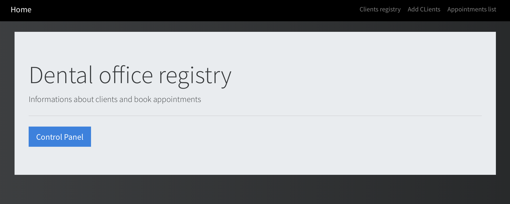
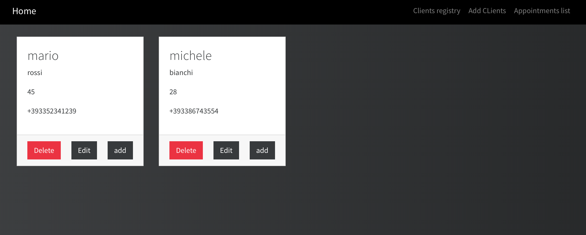
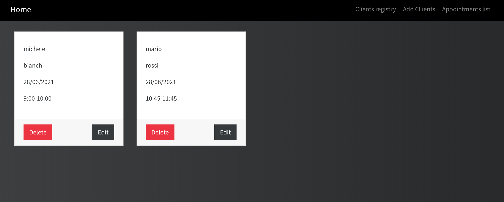

# Dentist clients and appointments registry
Using typescript(express) and MongoDB



## Getting Started

- Insert name, surname, age and phone of client
- With add button in the client window you can book an appointment
- Appointment format: 
  - date : gg/mm/aa 
  - hour : xx:xx-yy:yy (for example 9:00-10:00) 
- Check in the insertion of the appointment to verify if there is already one on that date and hour
- Clients and appointments are editable


## Installation
In VSCode open terminal and digit:
```bash
npm install
npm run build
npm start
```
